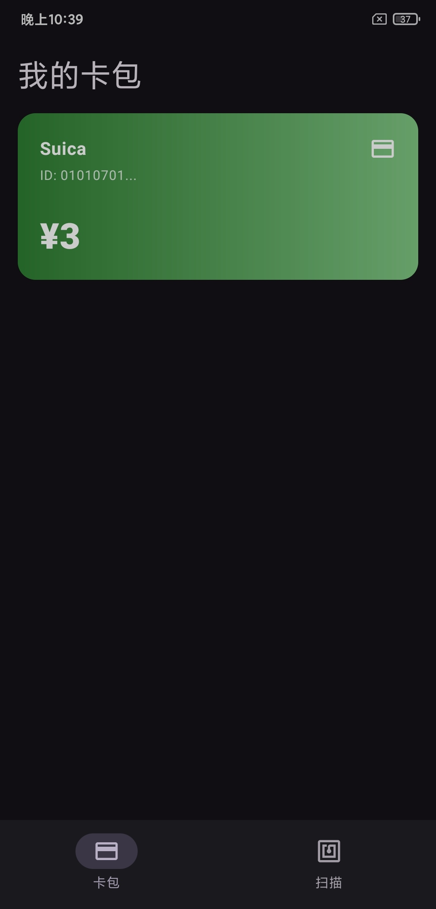
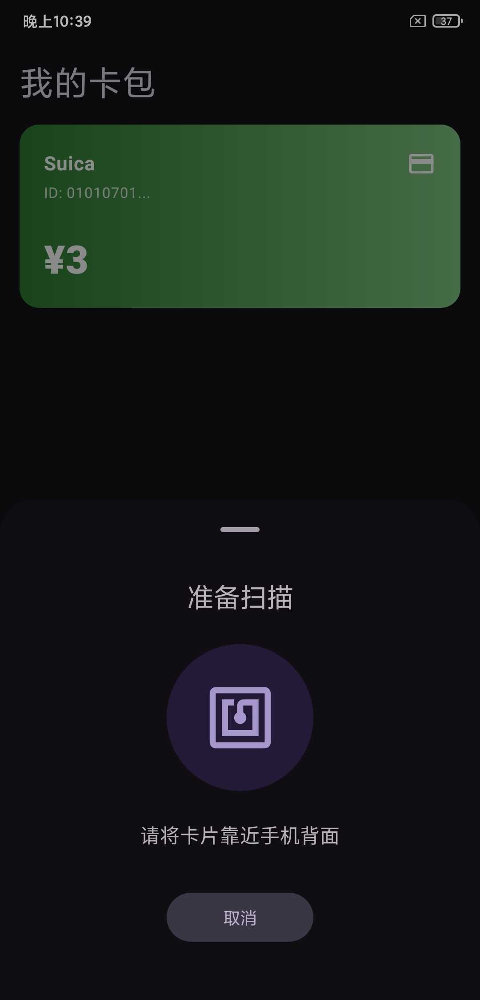
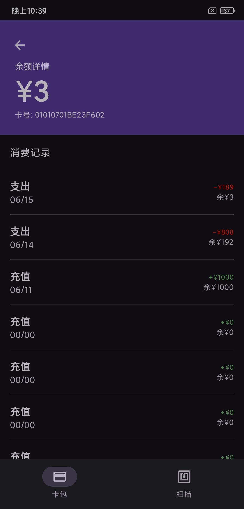

# NFC Reader

一个基于 Android Jetpack Compose 的 NFC 扫描器应用，主要用于读取 Suica 卡（`android.nfc.tech.NfcF`）的余额与交易历史。

## ✨ 开发初衷

目前市面上拥有类似 NFC 读取功能的应用，但多数 UI 设计复杂且广告过多，影响使用体验。开发这个 App 的目的是提供一个界面简洁、交互直观、无广告的 Suica NFC 读取器，让用户可以专注于快速扫描和查看卡片信息。

## 🚀 功能亮点

- ✅ 支持 Suica 卡 NFC 读取
- ✅ 自动进入 NFC Reader Mode，并实现 `TECH_DISCOVERED` 识别
- ✅ 提供卡包列表与卡片详情页
- ✅ 支持卡片数据本地持久化保存（`SharedPreferences` + `Gson`）
- ✅ 扫描成功后触发震动与提示音反馈
- ✅ 现代 Material 3 风格界面，使用 Jetpack Compose 构建

## 🧰 主要技术栈

- Android SDK 37 / Kotlin
- Jetpack Compose
- Material 3
- NFC API：`NfcAdapter`, `Tag`, `NfcF`
- Gson
- SharedPreferences

## 🎯 适用场景

- 支持 NFC 功能的Android设备
- Android 7.0+（`minSdkVersion 24`）
- 主要面向 Suica 卡读取场景

## 📦 项目结构

```text
app/src/main/java/com/example/nfc_reader/MainActivity.kt
  - NFC 读卡逻辑与 UI 的主要实现
  - 负责 ReaderCallback、卡片扫描、数据解析、UI 页面切换
app/src/main/AndroidManifest.xml
  - 权限声明：android.permission.NFC, android.permission.VIBRATE
  - NFC TECH_DISCOVERED 注册
app/src/main/res/xml/nfc_tech_filter.xml
  - 只监听 android.nfc.tech.NfcF NFC 类型
app/build.gradle.kts
  - Compose、Material 3、Gson 等依赖配置
```

## ⚡ 快速运行

下载发行版apk安装包后安装使用

## 🖼️ 应用截图

<p align="center">
  <div style="display:inline-block; text-align:center; margin:0 12px;">
    <p><strong>主界面</strong></p>
    
  </div>
  <div style="display:inline-block; text-align:center; margin:0 12px;">
    <p><strong>扫描界面</strong></p>
    
  </div>
  <div style="display:inline-block; text-align:center; margin:0 12px;">
    <p><strong>详细信息界面</strong></p>
    
  </div>
</p>

## 📝 使用说明

1. 打开 App 后进入“卡包”页面
2. 点击底部导航栏中的“扫描”按钮
3. 将 Suica 卡靠近手机背面 NFC 区域
4. 扫描成功后，自动跳转至卡片详情页并展示余额、交易记录

## ⚠️ 注意事项

- 该项目当前仅支持 suica 卡
- 需要设备支持 NFC 并已开启 NFC 功能
- 如果没有 NFC 功能或权限未开启，应用将无法读取卡片

## 🌱 未来扩展

- 支持更多 NFC 卡类型
- 增加导出数据功能

## 🤝 贡献邀请

欢迎 Fork 此项目，提交 PR 贡献 UI 改进、卡片兼容性优化或更多功能

---

`NFC_Reader` by Android NFC 阅读器项目
